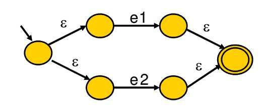
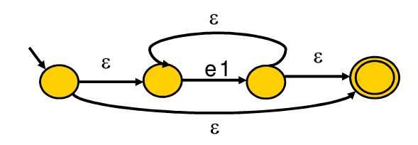

## 实现脚本语言

- 词法分析：把程序分割成一个个 Token 的过程，可以通过构造有限自动机来实现
- 语法分析：把程序的结构识别出来，并形成一棵便于由计算机处理的抽象语法树。可以用递归下降的算法来实现
- 语义分析：消除语义模糊，生成一些属性信息，让计算机能够依据这些信息生成目标代码

### 词法分析器

实现一个词法分析器，首先需要写出每个词法的正则表达式，并画出有限自动机，之后，只要用代码表示这种状态迁移过程就可以了

有限状态自动机 $M = (Σ, S, q_0, F, δ)$，分别是字符集、状态集、初始状态、终结状态（集）、转移函数

- 确定状态有限自动机 DFA：对任意字符，最多有一个状态可以转移，$F$ 是终结状态
- 非确定状态有限自动机 NFA：对任意字符，有多于一个状态可以转移，$F$ 是终结状态集

```text
   Thompson 算法      子集构造算法      Hopcraft 最小化算法
RE ------------> NFA ----------> DFA -----------------> 最小化 DFA ------> 词法分析器代码
```

#### RE -> NFA

- `e -> ɛ`

- `e -> c`

- `e -> e1 e2`

- `e -> e1 | e2`

- `e -> e1*`


由上面构造 `a(b|c)*` 得


#### NFA -> DFA

```fakecode
// eps_closure 可用 BFS 或 DFS 实现
q0 <- eps_closure(n0)   // q0 = {n0}
Q <- {q0}       // Q = {q0}
workList <- q0     // workList = [q0, ...]
while(workList != [])   
    remove q from workList   // workList = [...]
    foreach(character c)     // c = a
        t <- e-closure(delta(q,c))   // delta(q0, a) = {n1}, t = {n1, n2, n3, n4, n6, n9}
        D[q,c] <- t    //   q1 = t
        if(t not in Q)    // Q = {q0, q1} , workList = [q1]
            add t to Q and workList
```

`a(b|c)*` 进行转换可得

`q1 = {n1, n2, n3, n4, n6, n9}`
`q2 = {n5, n8, n9, n3, n4, n6}`
`q3 = {n7, n8, n9, n3, n4, n6}`

图像：

Hopcraft 最小化算法将 DFA 转化为最小化 DFA

```fakecode
//基于等价类的思想
split(S)
    foreach(character c)
        if(c can split s)
            split s into T1, ..., Tk

hopcroft()
    split all nodes into N, A
    while(set is still changes)
        split(s)
```


先分为非终结状态 `N: {q0, q1, q2, q4}` 和终结状态 `A: {q3, q5}`，在 N 中 q0 和 q1 在接受 e 的条件下最终得到的状态还是在 N 的内部。所以可以将其根据 e 拆分成 `{q0, q1}`，`{q2, q4}`，`{q3, q5}`。q0 和 q1 ，在接受 e 的时候，q0 最终得到还是在 `{q0, q1}` 这个状态的结合中，q1 却会落在 `{q2, q4}` 的状态中，所以可以将 q0 和 q1 分为 `{q0}`，`{q1}`


